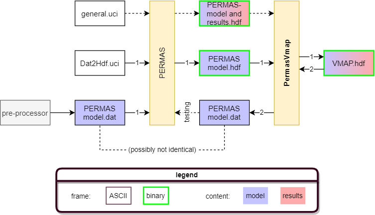

[](https://doi.org/10.5281/zenodo.7360515)
# PermasVmap

A converter from Permas to VMAP and vice versa.

## What's this
This software converts **models and results** from the Finite Element software **[Permas](https://www.intes.de/?neue_sprache=en)** to **[VMAP](https://vmap.vorschau.ws.fraunhofer.de)** vice versa. It is written in Python with automated applications in mind, such as cross-disciplinary optimization. The initial focus is on 3D scenarios with solid volume elements only but extensions to other kinds of elements (shells etc.) are envisioned.

### Why use VMAP?
In our view, VMAP provides two critical features that cannot be found elsewhere
1. **Central** conversion data format. It provides **interfaces to more than 25 simulation softwares**, and counting.
2. **Standardized** [HDF5](https://www.hdfgroup.org/solutions/hdf5) format specification that is productive for structural FE simulations. The fact that **both models and results are machine accessible without parsing ASCII**, using open source software only, enables much needed efficiency at low entry barriers.
   
## Main workflows

1. (Permas-ASCII ->) Permas-HDF -> VMAP
   - for FE model and/or results
   - the first step (model only) needs to be done by Permas, see [Getting started _using_ the code](./README.md#getting-started-using-the-code).
   - for the second step see PermasHdf2Vmap.py
2. VMAP -> Permas-ASCII
   - for FE model only
   - see Vmap2PermasAscii.py
  
In the workflow graph above, the input of 1 and the output of 2 may possibly not be identical for the reason that not all features of Permas (e.g. element types) are implemented at the moment. Also, nodes that do not belong to any elements are dropped (e.g. that are exclusively used for the definitions of coordinate systems).

## Key features
1. **Performance**. The code was fairly optimized for speed. Models with millions of elements can be converted within seconds ... or minutes, depending on the circumstances.
2. **Reliability**. The code is tested end-to-end at [DLR-BT](https://dlr.de/bt) using multiple non-academic test models.

## Detailed list of features
1. Supported elements: HEXE8, TET10
2. Supported analysis types:
   - STATIC
   - NLMATERIAL
   - VIBRATION ANALYSIS
   - VIBRATION ANALYSIS with nodal diameter
3. Further supported model keywords:
   - $NSET (assumption: each NSET is contained in one ESET)
   - $SURFACE ELEMENTS (assumption: each SURFACE is contained in one ESET)
   - $SFSET
   - $MATERIAL with $ELASTIC GENERAL (no temperature dependence) and $DENSITY
   - $ELPROP with MATERIAL
   - $RSYS (not fully functional yet)

## Getting started _using_ the code

### Requirements
- VMAP v1.0.0 (Windows binaries will soon be included in this repository)
- Python envionment according to [environment.yml](./environment.yml). The code should work with Python 3.7 but is only tested with the newer version stated in the file.

### Instructions

#### Setup
1. Set up a python environment including the modules listed in [environment.yml](./environment.yml), e.g. using [conda](https://conda.io).
2. Copy the file [./local/local_imports.py.template](local/local_imports.py.template) to _./local_imports.py_ and adapt it so that you local VMAP instance is found.
2. Activate the environment
3. change to the code's root directory

#### Example testing
Follow the setup instructions first, then:
1. Run `python Permashdf2Vmap.py rotorsegment.hdf`.
2. See the result in the [data](/data) subfolder: the input file [rotorsegment.hdf](/data/rotorsegment.hdf) was converted to _rotorsegment_toVMAP.hdf_ according to the VMAP standard.
3. Run `python Vmap2PermasAscii.py rotorsegment_toVMAP.hdf` for the inverse conversion.
4. See the result in the [data](/data) subfolder: the input file _rotorsegment_toVMAP.hdf_ was converted to _rotorsegment_toVMAP_toPERMASASCII.dat_.
5. For more info on the usage, run `python Permashdf2Vmap.py` or `python Vmap2PermasAscii.py` to see explanations and examples of the possible arguments.

#### Productive usage
Follow the setup instructions first, then:
1. In your Permas-UCI file, include the following lines:
```
! header section:
DEFAULT SET HDF_DATASIZE=64 ! sets maximum accuracy for HDF data
! [...]
! TASK section:
	EXPORT
		ITEM MODL
		GO PERMAS BINARY
```
2. Run Permas.
3. Move the resulting <project>.hdf file to the [data](/data) subfolder of this repository.
4. Run `python Permashdf2Vmap.py <project>.hdf`.
5. Enjoy the multitude of possible workflows enabled by the [VMAP-ecosystem](https://vmap.vorschau.ws.fraunhofer.de/en/tools.html).

If you just want to convert your model to VMAP, i.e. without any simulation results, run Permas with the following UCI:
```
SET DATABASE = DELETE

NEW
INPUT
	READ PERMAS FILE = my_permas_model.dat
RETURN

TASK
	EXPORT
		MODEL
		GO PERMAS BINARY
TASK END
STOP
```

## Getting started _contributing to_ or _adapting_ the code
See [CONTRIBUTING.md](CONTRIBUTING.md). There you can also find information on the reasonig behind features, workflows etc.

## Authors and acknowledgment
Nadine Barth and Oliver Kunc were the initial main developers.

## Citing
See the DOI link at the top.

## License
Licensed under the Apache License, Version 2.0, see [LICENSE](LICENSE).

## Project status
Development of this project is **active** (2023). Contributions are highly welcome, see [CONTRIBUTING.md](CONTRIBUTING.md) for more information.
